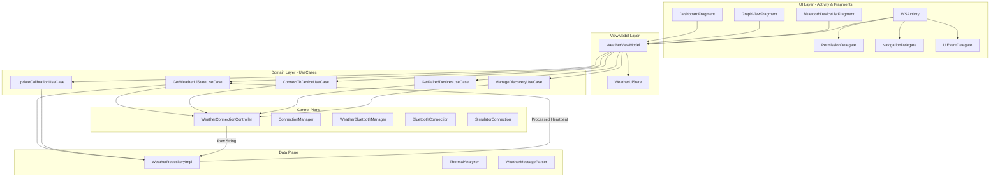

# Weather Station - Android Architecture

This document describes the high-level architecture of the Weather Station Android application, illustrating how components interact to provide real-time data monitoring and thermal analysis.

## 🏗️ Architectural Overview

The application follows a modern **MVVM (Model-View-ViewModel)** pattern with a strict separation between the **Control Plane** and the **Data Plane**, and a **Delegated Activity** structure in the UI layer.

### 🛂 Plane Separation
1.  **Data Plane (`WeatherRepository`)**: Handles sensor data processing, protocol parsing, and analytical trend calculation using the **Single Heartbeat** pattern.
2.  **Control Plane (`WeatherConnectionController`)**: Manages hardware lifecycles, Bluetooth adapter state, device discovery, and connection orchestration.

### 🏛️ Delegated Activity Architecture
To prevent `WSActivity` from becoming a "God Object", its responsibilities are delegated to specialized components:
- **`PermissionDelegate`**: Manages runtime permission requests and results.
- **`NavigationDelegate`**: Orchestrates Toolbar, Drawer, and Jetpack Navigation.
- **`UIEventDelegate`**: Handles dialogs and state-driven Snackbars.

## 🧩 Key Components

### 1. **UI Layer (Delegates)**
- **`PermissionDelegate`**: Centralizes the logic for Location, Bluetooth, and Notification permissions required across different Android versions.
- **`NavigationDelegate`**: Manages the integration between the Activity's Toolbar and the Fragments' navigation lifecycle.
- **`UIEventDelegate`**: Decouples the presentation of dialogs (like Reconnect) from the core Activity lifecycle.

### 2. **Domain Layer (Specific UseCases)**
- **`GetWeatherUiStateUseCase`**: Aggregates the atomic heartbeat from the Data Plane and hardware state from the Control Plane.
- **`ConnectToDeviceUseCase`**: Executes connection requests via the Control Plane.
- **`GetPairedDevicesUseCase`**: Retrieves filtered device lists from the Control Plane.

### 3. **Control Plane (`WeatherConnectionController`)**
The hardware orchestrator. Encapsulates all Bluetooth and connection management logic. Implements the "How" of the system.

### 4. **Data Plane (`WeatherRepository`)**
The analytical engine. Implements `HardwareEventListener` to process data from the Control Plane and produce the **Single Heartbeat**. Implements the "What" of the system.

## 📡 Data Flow Path (The Heartbeat)
1. **Control Plane** syncs raw bytes into a string frame and passes it to the **Data Plane**.
2. **Data Plane** parsed and calculates trends synchronously.
3. **Data Plane** bundles everything into **`ProcessedWeatherData`** and posts it.
4. **UI Layer** observes the unified state and updates charts and text atomically.
