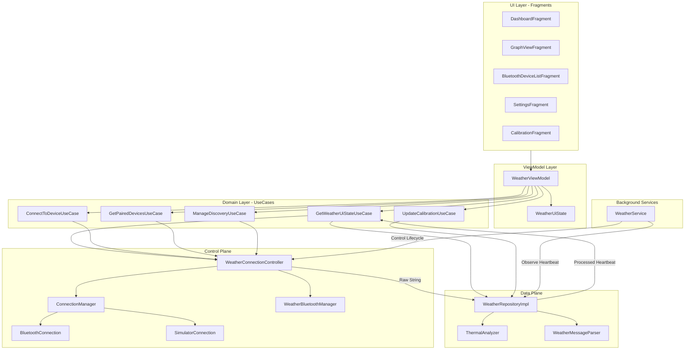

# Weather Station - Android Architecture

This document describes the high-level architecture of the Weather Station Android application, illustrating how components interact to provide real-time data monitoring and thermal analysis.

## 🏗️ Architectural Overview

The application follows a modern **MVVM (Model-View-ViewModel)** pattern with a strict separation between the **Control Plane** and the **Data Plane**, bridged by a dedicated **Domain Layer (UseCases)**.

### 🛂 Plane Separation
1.  **Data Plane (`WeatherRepository`)**: Handles the "What". It manages sensor data processing, protocol parsing, and analytical trend calculation.
2.  **Control Plane (`WeatherConnectionController`)**: Handles the "How". It manages hardware lifecycles, Bluetooth adapter state, and connection orchestration.

### 💓 The Single Heartbeat Pattern
*   The **Data Plane** processes raw data immediately upon arrival and publishes a single, atomic **`ProcessedWeatherData`** heartbeat.
*   This ensuring that all UI components (charts, trends, scores) are perfectly synchronized.

## 🧩 Key Components

### 1. **Domain Layer (Specific UseCases)**
- **`GetWeatherUiStateUseCase`**: The central aggregator. Observes the atomic heartbeat from the **Data Plane** and hardware state from the **Control Plane** to build the unified `WeatherUiState`.
- **`ConnectToDeviceUseCase`**: Executes connection requests. It tells the **Control Plane** which MAC address to target.
- **`GetPairedDevicesUseCase`**: Requests the list of available weather stations (physical or simulator) from the **Control Plane**.
- **`ManageDiscoveryUseCase`**: Controls the lifecycle of Bluetooth scanning via the **Control Plane**.
- **`UpdateCalibrationUseCase`**: Passes user-defined sensor offsets to the **Data Plane** for persistence and application.

### 2. **Control Plane (`WeatherConnectionController`)**
The hardware orchestrator. Encapsulates `BluetoothAdapter`, `ConnectionManager`, and discovery logic. It provides the "Raw String" stream to the Data Plane and manages the `ConnectionState`.

### 3. **Data Plane (`WeatherRepository`)**
The analytical engine. It implements `RawDataCallback` to receive strings from the Control Plane, runs the `WeatherMessageParser`, and triggers the `ThermalAnalyzer` to produce the **Single Heartbeat**.

### 4. **UI State (UDF)**
**`WeatherUiState`** is an immutable snapshot of the entire dashboard. This ensures that UI updates are atomic, consistent, and lag-free across fragments.

## 📡 Data Flow Path (The Heartbeat)
1. **Hardware** sends raw string: `WS_{"windSpeed": 5.2, ...}_end`.
2. **Control Plane** receives bytes, syncs frames, and passes the string to the **Data Plane**.
3. **Data Plane** parses the string and synchronously calculates trends and scores via **`ThermalAnalyzer`**.
4. **Data Plane** bundles everything into **`ProcessedWeatherData`** and posts it.
5. **`GetWeatherUiStateUseCase`** merges this heartbeat with connection status.
6. **Fragments** receive the new state and update all views in a single frame.
