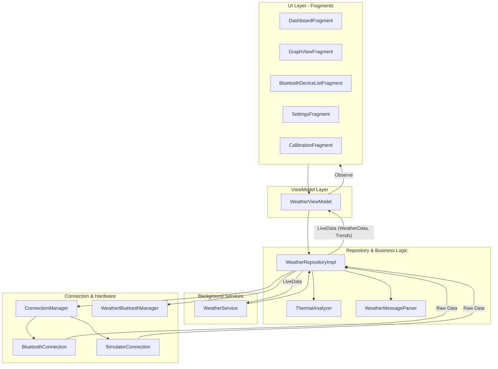

# Weather Station - Android Architecture

This document describes the high-level architecture of the Weather Station Android application, illustrating how components interact to provide real-time data monitoring and thermal analysis.

## 🏗️ Architectural Overview

The application follows a modern **MVVM (Model-View-ViewModel)** pattern, powered by **Dagger Hilt** for dependency injection and **Jetpack LiveData** for reactive data streams.

## 🧩 Key Components

### 1. **WeatherRepository (Central Hub)**
The `WeatherRepositoryImpl` acts as the single source of truth. It:
- Orchestrates the hardware connection via `ConnectionManager`.
- Processes raw data through `WeatherMessageParser`.
- Analyzes atmospheric trends using `ThermalAnalyzer`.
- Manages persistent historical data for charts.
- Broadcasts updates via `LiveData`.

### 2. **WeatherService (Persistence)**
A `LifecycleService` that runs in the foreground. It ensures the Bluetooth connection remains active even if the app is minimized, and provides a persistent notification with real-time wind and temperature updates.

### 3. **Connection Management**
- **`ConnectionManager`**: Abstraction layer that switches between physical Bluetooth hardware and the software Simulator.
- **`BluetoothConnection`**: Manages RFCOMM sockets and background threads (`Accept`, `Connect`, `Connected`) for reliable serial communication.
- **`SimulatorConnection`**: Generates realistic "virtual" weather data for testing thermal logic without hardware.

### 4. **Thermal Analysis**
The `ThermalAnalyzer` uses Exponential Moving Averages (EMA) to detect subtle temperature rises and wind drops, calculating a "Launch Suitability" score used by pilots in the field.

## 💉 Dependency Injection (Hilt)

The app is divided into three primary Hilt modules:

- **`AppModule`**: Provides global singletons like `Gson`, `SharedPreferences`, `Random`, and system services.
- **`RepositoryModule`**: Binds the repository and Bluetooth manager interfaces to their concrete implementations.
- **`ConnectionModule`**: Contains the logic to provide either `BluetoothConnection` or `SimulatorConnection` based on the user's "Simulator Mode" preference.

## 📡 Data Flow Path
1. **Hardware** sends raw string: `WS_{"windSpeed": 5.2, ...}_end`.
2. **`BluetoothConnection`** receives bytes, syncs frames, and sends them to the Repository.
3. **`WeatherRepository`** passes the string to `WeatherMessageParser`.
4. **`WeatherMessageParser`** returns a `WeatherData` object.
5. **`ThermalAnalyzer`** processes the object and returns a `LaunchDecision`.
6. **Repository** updates its `LiveData` observers.
7. **`WeatherViewModel`** exposes the data to the **Fragments** for UI rendering.
