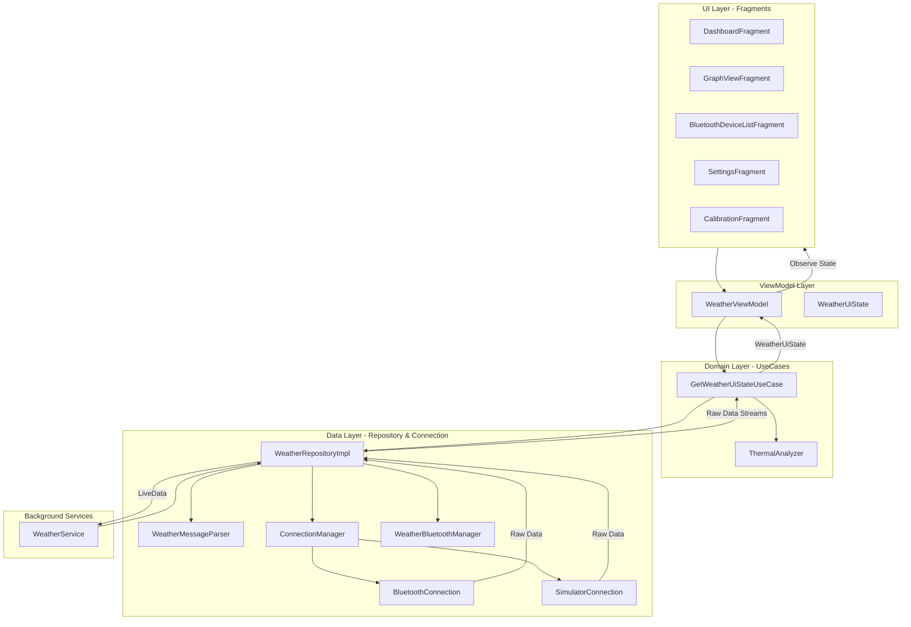

# Weather Station - Android Architecture

This document describes the high-level architecture of the Weather Station Android application, illustrating how components interact to provide real-time data monitoring and thermal analysis.

## 🏗️ Architectural Overview

The application follows a modern **MVVM (Model-View-ViewModel)** pattern, powered by **Dagger Hilt** for dependency injection and **Jetpack LiveData** for reactive data streams.

## 🧩 Key Components

### 1. **Domain Layer (Business Logic)**
- **`GetWeatherUiStateUseCase`**: The central aggregator. It observes all data streams from the repository (sensor data, connection state, trends) and merges them into a single, immutable `WeatherUiState`.
- **`ThermalAnalyzer`**: Encapsulates the core EMA algorithm for detecting thermals.

### 2. **Data Layer (Repository & Hardware)**
- **`WeatherRepositoryImpl`**: The single source of truth for raw data. It orchestrates hardware connections via `ConnectionManager` and handles data parsing.
- **`WeatherMessageParser`**: Handles protocol-level string extraction and JSON/Legacy parsing.
- **`Connection Management`**: Abstraction layer (`ConnectionManager`) switching between physical Bluetooth (`BluetoothConnection`) and software simulation (`SimulatorConnection`).

### 3. **Background Services**
- **`WeatherService`**: A `LifecycleService` that ensures the Bluetooth connection remains active in the background and provides a persistent notification with real-time updates.

### 4. **UI State (UDF)**
- **`WeatherUiState`**: An immutable snapshot of the entire dashboard state. This ensures that UI updates are atomic and consistent across fragments.

## 💉 Dependency Injection (Hilt)

The app is divided into three primary Hilt modules:

- **`AppModule`**: Provides global singletons like `Gson`, `SharedPreferences`, `Random`, and system services.
- **`RepositoryModule`**: Binds the repository and Bluetooth manager interfaces to their concrete implementations.
- **`ConnectionModule`**: Contains the logic to provide either `BluetoothConnection` or `SimulatorConnection` based on the user's "Simulator Mode" preference.

## 📡 Data Flow Path
1. **Hardware** sends raw string: `WS_{"windSpeed": 5.2, ...}_end`.
2. **`BluetoothConnection`** receives bytes, syncs frames, and sends them to the Repository.
3. **`WeatherRepository`** passes the string to `WeatherMessageParser`.
4. **`WeatherMessageParser`** returns a `WeatherData` object.
5. **`GetWeatherUiStateUseCase`** observes the repository, triggers `ThermalAnalyzer`, and merges all info into a new `WeatherUiState`.
6. **`WeatherViewModel`** exposes the unified `WeatherUiState` stream.
7. **Fragments** observe the single state object and update the UI atomically.
