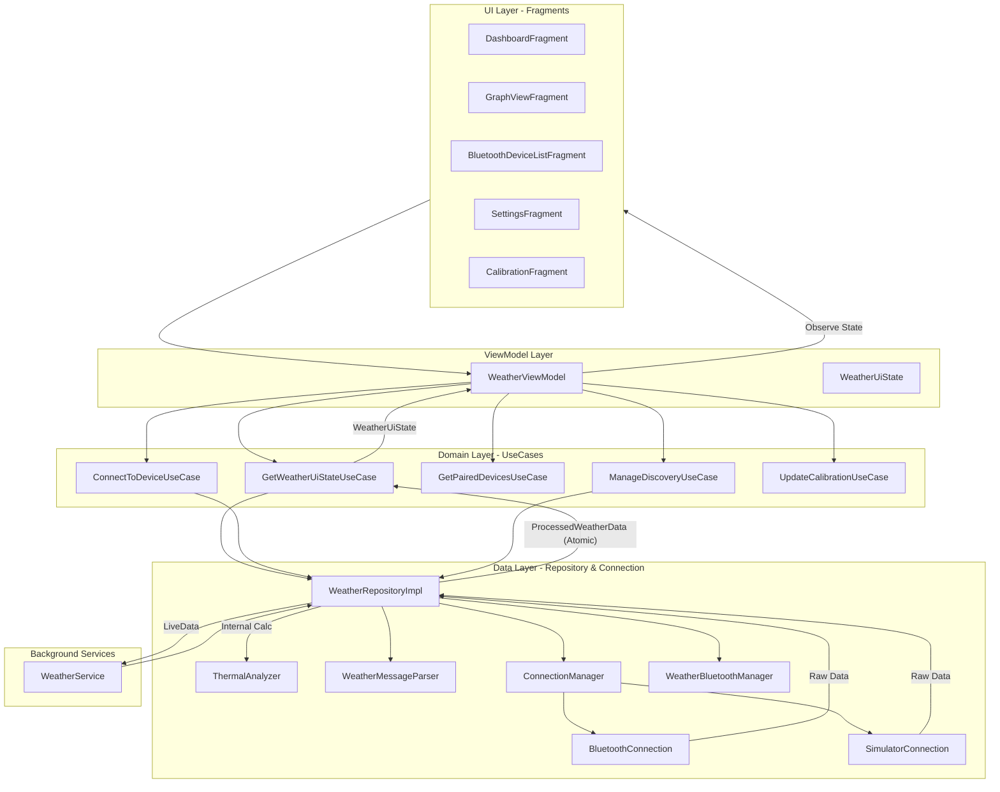

# Weather Station - Android Architecture

This document describes the high-level architecture of the Weather Station Android application, illustrating how components interact to provide real-time data monitoring and thermal analysis.

## 🏗️ Architectural Overview

The application follows a modern **MVVM (Model-View-ViewModel)** pattern, powered by **Dagger Hilt** for dependency injection and **Jetpack LiveData** for reactive data streams.

### 💓 The Single Heartbeat Pattern
To ensure absolute synchronization between raw sensor data and calculated analytical trends (like temperature deltas), the app uses a **Single Heartbeat** architecture. 

1.  **Repository** receives raw data.
2.  **Repository** immediately calculates all trends and scores.
3.  **Repository** publishes a single, atomic `ProcessedWeatherData` object.
4.  **UI Layer** receives this single event and updates all views (charts and text) in a single frame.

## 🧩 Key Components

### 1. **Domain Layer (Business Logic)**
- **`GetWeatherUiStateUseCase`**: The central aggregator. It observes the atomic heartbeat from the repository and transforms it into a unified, immutable `WeatherUiState`.
- **`ConnectToDeviceUseCase`**: Handles the logic of selecting between physical and virtual hardware and initiating connections.
- **`GetPairedDevicesUseCase`**: Encapsulates logic for filtering available weather stations.
- **`ManageDiscoveryUseCase`**: Controls the lifecycle of Bluetooth scanning.
- **`UpdateCalibrationUseCase`**: Manages the persistence of sensor offsets.

### 2. **Data Layer (Repository & Hardware)**
- **`WeatherRepositoryImpl`**: The coordinator. It orchestrates hardware connections, triggers the `ThermalAnalyzer`, and publishes the atomic `ProcessedWeatherData` heartbeat.
- **`ThermalAnalyzer`**: Encapsulates the EMA algorithm. It is triggered synchronously by the Repository upon data arrival.
- **`WeatherMessageParser`**: Handles protocol-level string extraction and locale-independent parsing (supporting both `.` and `,` separators).
- **`Connection Management`**: Abstraction layer (`ConnectionManager`) switching between physical Bluetooth (`BluetoothConnection`) and software simulation (`SimulatorConnection`).

### 3. **Background Services**
- **`WeatherService`**: A `LifecycleService` that ensures the Bluetooth connection remains active in the background and provides a persistent notification with real-time updates.

### 4. **UI State (UDF)**
- **`WeatherUiState`**: An immutable snapshot of the entire dashboard state. This ensures that UI updates are atomic and consistent across fragments.

## 💉 Dependency Injection (Hilt)

The app is divided into three primary Hilt modules:

- **`AppModule`**: Provides global singletons like `Gson`, `SharedPreferences`, `Random`, and system services.
- **`RepositoryModule`**: Binds the repository and Bluetooth manager interfaces to their concrete implementations.
- **`ConnectionModule`**: Contains the logic to provide either `BluetoothConnection` or `SimulatorConnection` based on user preference.

## 📡 Data Flow Path (Single Heartbeat)
1. **Hardware** sends raw string: `WS_{"windSpeed": 5.2, ...}_end`.
2. **`BluetoothConnection`** receives bytes, syncs frames, and sends them to the Repository.
3. **`WeatherRepository`** passes the string to `WeatherMessageParser`.
4. **`WeatherRepository`** immediately triggers `ThermalAnalyzer` with the parsed data.
5. **`WeatherRepository`** bundles raw data + trends into a **`ProcessedWeatherData`** object and posts it.
6. **`GetWeatherUiStateUseCase`** observes the heartbeat and creates a new **`WeatherUiState`**.
7. **Fragments** observe the single state object and update charts/text atomically.
