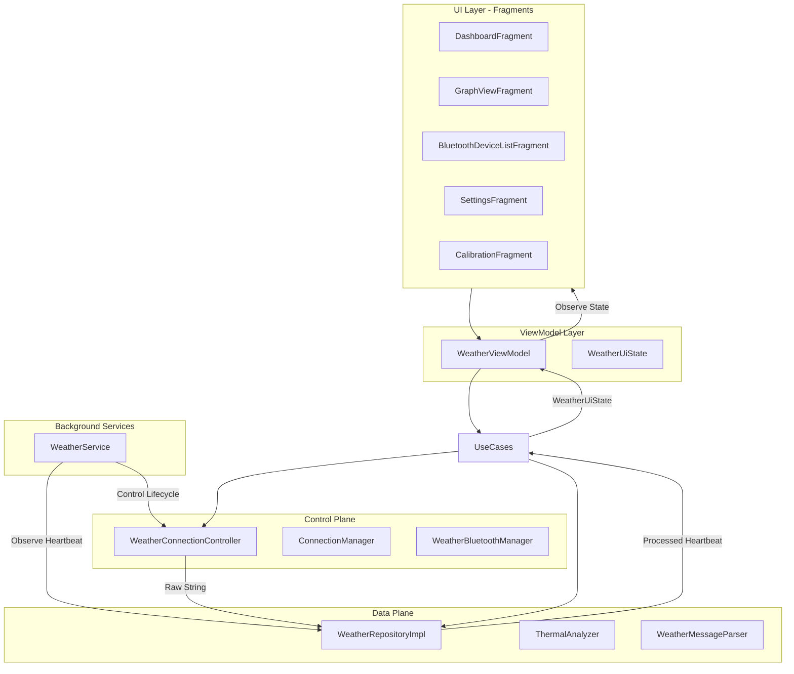

# Weather Station - Android Architecture

This document describes the high-level architecture of the Weather Station Android application, illustrating how components interact to provide real-time data monitoring and thermal analysis.

## 🏗️ Architectural Overview

The application follows a modern **MVVM (Model-View-ViewModel)** pattern with a strict separation between the **Control Plane** and the **Data Plane**.

### 🛂 Plane Separation
To prevent architectural bloat and ensure maintainability, the application logic is divided into two primary planes:

1.  **Data Plane (`WeatherRepository`)**: Responsible for sensor data processing, protocol parsing, and analytical trend calculation. It implements the **Single Heartbeat** pattern to publish atomic updates.
2.  **Control Plane (`WeatherConnectionController`)**: Responsible for hardware lifecycles, Bluetooth adapter state, device discovery, and connection orchestration (including auto-reconnect).

### 💓 The Single Heartbeat Pattern
1.  **Repository** receives raw data from the Control Plane.
2.  **Repository** synchronously calculates all trends and scores.
3.  **Repository** publishes an atomic **`ProcessedWeatherData`** heartbeat.
4.  **UI Layer** receives this single event, ensuring charts and text are always synchronized.

## 🧩 Key Components

### 1. **Control Plane (`WeatherConnectionController`)**
Orchestrates the hardware. It manages `BluetoothAdapter` states, handles discovery broadcasts, and maintains the `ConnectionState`. It provides the "raw" data pipeline to the Data Plane.

### 2. **Data Plane (`WeatherRepository`)**
Processes the data. It takes raw strings, runs them through the `WeatherMessageParser`, triggers `ThermalAnalyzer` for trend calculations, and manages the historical data buffer.

### 3. **Domain Layer (UseCases)**
The bridge between planes. UseCases like `GetWeatherUiStateUseCase` aggregate data from the Data Plane and hardware state from the Control Plane to provide a unified `WeatherUiState` to the ViewModel.

### 4. **UI State (UDF)**
**`WeatherUiState`** is an immutable snapshot of the entire dashboard. This ensures that UI updates are atomic, consistent, and lag-free across fragments.

## 💉 Dependency Injection (Hilt)
- **`AppModule`**: Global singletons (Gson, SharedPreferences).
- **`RepositoryModule`**: Binds the Data and Control plane interfaces to their concrete implementations.
- **`ConnectionModule`**: Logic for switching between Bluetooth and Simulator hardware.
